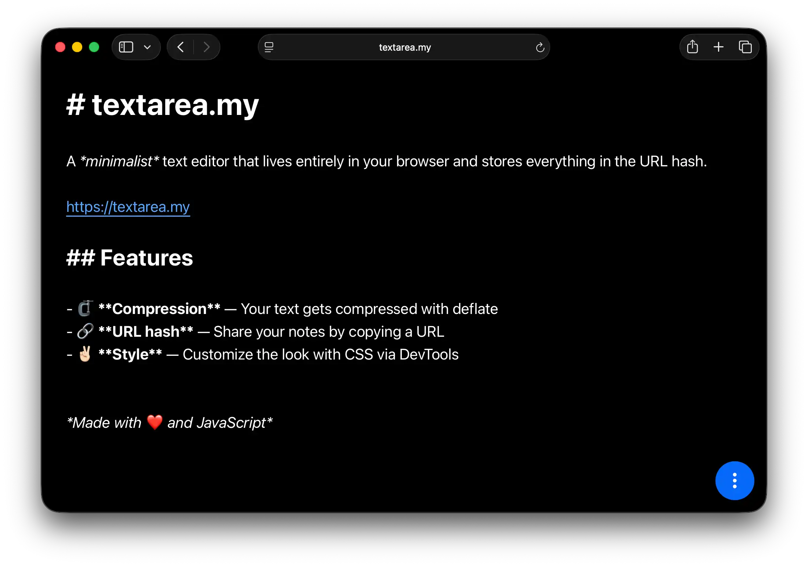

# [textarea.my](https://textarea.my)

A _minimalist_ text editor that lives entirely in your browser and stores everything in the URL hash.

<p align="center">
  <a href="https://textarea.my/#VZA9TgMxEIV7n2KkdJZIejoURIGgYaGgnGSHeITXXtmzG0zFAZDSREoTlIZDIHGbXIAcAXsTClrP-_meRyD0IhgIx01S6gJ0w44btBxFDzegmsUHEIMClnuKQE44kE3ADpLvAsyCX0YKgK6GmMVF01NIYtgtikoMwcPdDRiMZqyUEWnj-WTyr3s0gitC6bJbqTM47Dbbn68VaD31TZsfI3unNezf1vBYSge4BUmE-UlANSxZDNT0ZFFoCFlvcsJf9clemVx6JHdeMuws5Yw2FVgsnNm5374fdqvvbK4kWTo5p12e1_ArDYus98_HxmlVQc8Il9Tfe2_zAKVvsabjdf_xWZaU37nGHqt54FZ01vwC">  
    
  </a>
</p>

## Features

- � **Markdown** – Write in simple Markdown with a toolbar and instant preview
- 🖼️ **Images** – Drag & drop or paste images directly (auto-compressed)
- 🗜️ **Compression** – Smart compression (Zstd/Deflate) keeps URLs as short as possible
- � **Offline Ready** – Works entirely offline as a Progressive Web App (PWA)
- �🔗 **URL hash** – No servers. Your data lives in the URL and LocalStorage
- 💕 **Style** – Customize the look with CSS via DevTools (changes are saved!)

## Pro tips

- **Save as HTML**: Press `Ctrl/Cmd + S` to save your note as a standalone HTML file
- **Read-Only Link**: Click the "Eye" icon or add `?view` to the URL to share a non-editable version
- **Custom Title**: The first line `# My Title` becomes the page title and filename
- **Embed Images**: Paste images from clipboard – they get compressed and stored in the URL
- **QR Code**: Add [`/qr`](https://textarea.my/qr#c0_NSy1KLElVSFQIDFJIzk9JVUjLL1KozC8tUsjLL0ktVgQA) to the end of the URL (before the hash) to get a QR code

## Docker

You can host your own instance using Docker.

### Using Docker Compose

```bash
docker-compose up -d
```

### Manual Build

```bash
docker build -t textarea .
docker run -d -p 8080:80 textarea
```

The application will be available at http://localhost:8080

## Examples

<!-- - [Crime and Punishment (by Fyodor Dostoevsky)](https://medv.io/goto/crime-and-punishment-by-fyodor-dostoevsky.html) -->
- [A Markdown Example](https://textarea.my/#Xc9NT8JAEAbg-_6KV7hAQyB86AFCjDdMiAej9y7dobuy7NTdqWKM_e2mhVOP88z3EDvSxoUSe_oij7lSw2HPFq31cdlhX1dX7fP9jfv-oNQLx7P2qHTUZdSVhdBFcKAjR4IL3gXCsa0RcaGcKvVmXULHBQfRLiRk2YG96TqzbILMifauuMYT6GDQNEmiO5HYyHV5XdI00N5DuCSxFKdKPYfbXEOgiz5XntbICw5JcMEWq8UmV-oJ7697JMu1NzgQDAkVQqZbJHUMZOCCMHR75mkNK1Kl9Wx2Gzkt-DyrtNjHz5riz3a-WA6tTlapPM8_kjrWoRDHAZa859EYvwrtr4k9TT2Xo8GuTUzwzdGbu8F4o_7a1n8=)
- [An Ode to Comic Sans](https://textarea.my/#TVM9j9w2EE3NX_FwaRJAtwe4SHGu7g5I4MII4HNgpByRI4lZiqPMjFbeVPsj0hiI_9z-koCyDV9FznA-33v8EQ8VvyeGC55kzhHPVC2E73eQaj6xYcs-yeogO-Y6duEBo-aKXOHnRUalZcoRg-jchedJuFBkw1o9c-pghblVUSmFE9alC09KNuU6widGT_XvlR0ywFjzAKoJVXQ-hPAoWlFlf5xJ-8KYqBSDKApt6DXzYF14XB1JJBW2DrYwxwn92ve7TZioptuktFUshakLb7xF0dH2JSbGSXLk1qUZsZCZisxYxJz1Plwv_z0yjrmm7nr5jGbSkWFU-JvjVQMAgzIfrpfPIbyf-Ds8rAaLMgwdKP21mrc-WXFkrTukT2X1OOE3UpqlJpR8ZCxMWgzkSLTVQ_iT_QVV2OjU1lsr9WQTpy48Tcw6rKWcsanUsYP52veitZwh9RDa4ptmZ0Of1adEZ0TSZDvoRcxvk4wYypnVWr1V44TKmxV2bz5YHqvBaeGEqCJHTk1CSUTt0OonYds526ZsCysWZfM8ciNtkY31evl3Z6CJyroG3jsu9PGAD3y9fDoxjLliE7WvWL6VeGxSmnluBztrpbZlX2jmFH4VRdQ8syE7Kp9YQUUqI8o8Z_cGzhtHz6S2U7xxHqddVtM6U4WTOYcP2ScQbM6F4RM5ItXr5VPLBKfsnA4hPNQE81xKa7awWjb_KrNlOYNizImrd-GPGkVKY6gXn1jb7GtVHnJtA73jOdf07RtsoiV1TY8qa03ceqgc2brwvk3SEKVSWlwyVP4C-8akIHjmww8BAHqKx3GvcI9Vy093dzOn0yHLHZmx2505qR3GPPz8ek8YpPrtQHMu53vcvJDX2-eb7qXjpkNc1fKJXyRa_ofv8eqX5eMXZ5Qiet-od34d_gc=)

## Related

- [numbr.dev](https://numbr.dev) – my another website, same as textarea, only support calculations like `1 USD in EUR =`.

---

*Made with ❤️ and JavaScript*
